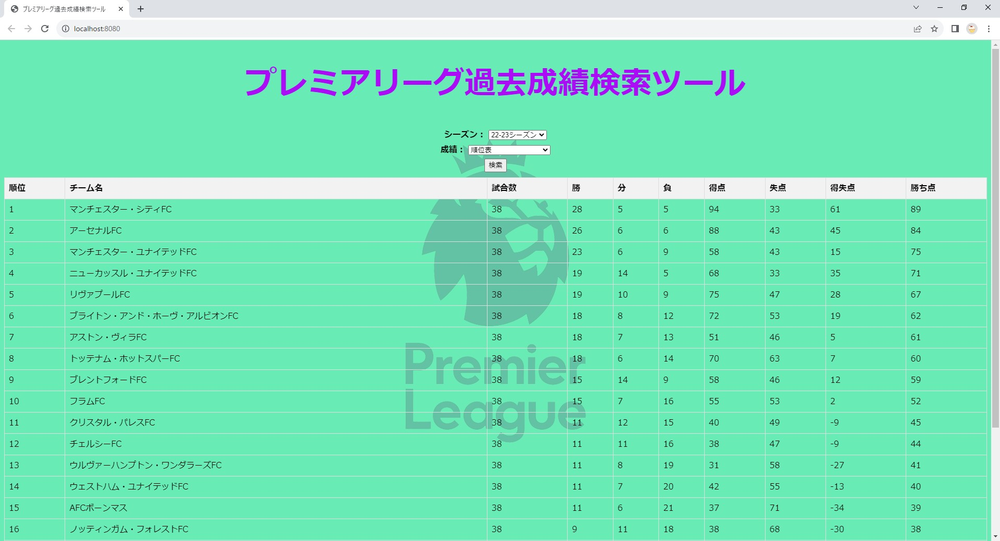

# football-EPL

##　概要
プレミアリーグの過去成績（順位、得点王、アシスト王、最優秀 GK 賞、年間 MVP、年間最優秀若手選手賞）を画面に出力するアプリです。

## 作ろうと思った理由

- SQL、JavaScript を勉強したかったため
  > → データベースを自作し、Node.js を用いてデータベースとの接続を実装した
- プレミアリーグに非常に興味があり、シーズン毎の成績を簡単に知りたいと思った

## 出力例

